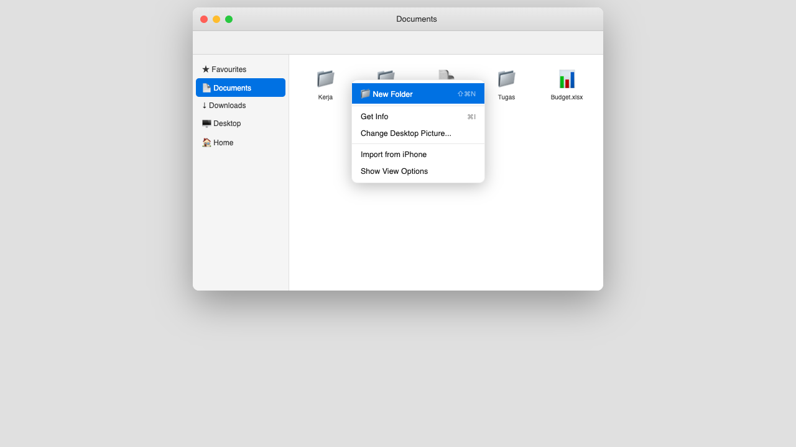
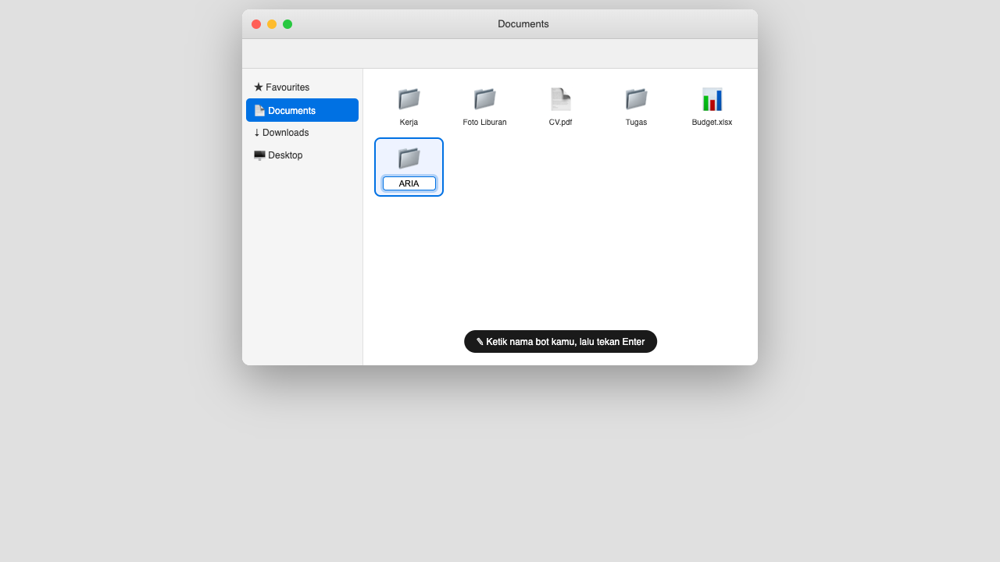
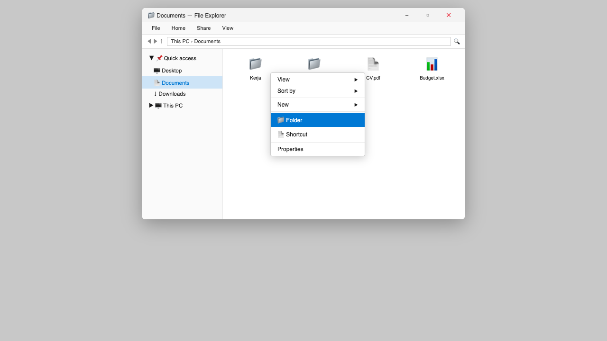
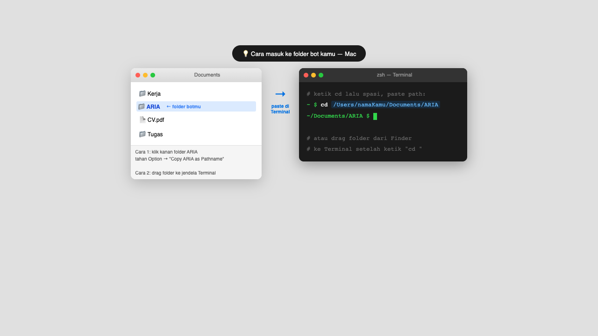
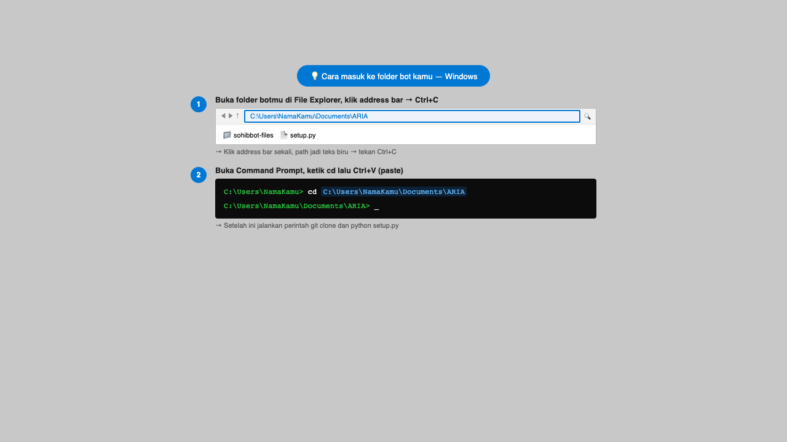

# SohibBot

**Bot Telegram pribadi dengan otak Claude Code — jalan di laptopmu, ingat segalanya.**

Bot ini berbeda dari ChatGPT. Dia:
- Jalan di **laptopmu sendiri**, bukan di server orang lain
- Punya **akses penuh ke file di laptopmu** — bisa baca, edit, jalankan apa saja
- Punya **memory persisten** — ingat konteks antar sesi, makin lama makin kenal kamu
- Bisa **perbaiki dirinya sendiri** kalau ada bug (kirim "halu" ke bot)
- Bisa **belajar dari web** dan simpan hasilnya ke memory

---

## Install dalam 3 langkah

**1. Punya dulu:**
- Laptop (Mac/Linux/Windows)
- Akun [Claude Pro/Max](https://claude.ai) ($20/bulan — sudah include Claude Code CLI)
- Akun Telegram

**2. Buka Terminal, pilih folder, lalu jalankan wizard:**

Pertama, buat folder khusus untuk bot kamu. Beri nama sesuai nama bot yang kamu mau — misalnya `ARIA`, `NOVA`, atau apapun. Jangan langsung taruh di Documents — buat subfolder sendiri supaya rapi dan tidak tercampur file lain.

**Mac** — buka Finder → Documents → klik kanan → New Folder:



Beri nama sesuai nama bot kamu, lalu tekan Enter:



**Windows** — buka File Explorer → Documents → klik kanan → New → Folder:



**Linux** — buka File Manager → Documents → klik kanan → New Folder → beri nama sesuai nama botmu.

---

Kedua, buka Terminal (aplikasi untuk ketik perintah):
- **Mac** — tekan `Command + Spasi`, ketik `Terminal`, Enter
- **Windows** — tekan `Windows + R`, ketik `cmd`, Enter
- **Linux** — tekan `Ctrl + Alt + T`

Ketiga, masuk ke folder yang baru dibuat. Ganti `NamaBot` dengan nama folder yang kamu buat. Cara paling mudah: salin path-nya langsung dari Finder/Explorer, lalu paste ke terminal.

**Mac:**



**Windows:**



Keempat, jalankan perintah berikut satu per satu (copy-paste, Enter setiap baris):

- **Mac/Linux:**
  ```bash
  git clone https://github.com/wildanrivky/sohibbot.git
  cd sohibbot
  python3 setup.py
  ```
- **Windows:**
  ```cmd
  git clone https://github.com/wildanrivky/sohibbot.git
  cd sohibbot
  python setup.py
  ```

> Belum punya Git? Download di [git-scm.com](https://git-scm.com/downloads), install, lalu ulangi langkah di atas. Atau baca cara download tanpa Git di [ONBOARDING.md](ONBOARDING.md#5-step-3--download-sohibbot).

**3. Ikuti pertanyaan wizard** → bot langsung jalan di Telegram.

Tidak perlu skill coding. Wizard yang handle semuanya.

---

## Fitur

- **Chat natural** — ngobrol seperti ke teman, bot tahu konteksmu
- **Memory persisten** — ingat 20 pesan terakhir (short-term) + catatan jangka panjang di `memory/`
- **Belajar dari web** — `/learn [topik]`, konten tersimpan di memory
- **Agent modular** — tambah "spesialis" untuk task tertentu (konten, riset, manajemen)
- **Self-fix** — kirim `halu` kalau bot error, dia perbaiki sendiri
- **Auto-restart** — service manager (launchd/systemd/Task Scheduler) pastikan bot nyala lagi setelah reboot

---

## Cara pakai sehari-hari

Buka Telegram → chat ke botmu seperti chat teman biasa.

Perintah khusus:
- `/learn [topik]` — belajar dari web
- `/note [catatan]` — simpan catatan cepat
- `/memory` — lihat semua catatan
- `/reset` — hapus riwayat percakapan
- `/help` — lihat semua perintah

---

## Yang dibutuhkan

| Item | Kenapa | Cara dapat |
|---|---|---|
| Laptop Mac/Linux/Windows | Tempat bot jalan | Punya sendiri |
| Akun Claude Pro/Max | Otak bot | claude.ai → upgrade |
| Akun Telegram | Chat dengan bot | Install Telegram |
| 30 menit waktu setup | Ikuti wizard | Sediakan waktu |

**TIDAK perlu:** Anthropic API key, kartu kredit untuk API, skill coding, server/VPS.

---

## Catatan penting

- Bot hanya hidup kalau **laptop nyala dan tidak sleep**
- Bot hanya bisa diakses oleh **kamu sendiri** (pakai Telegram User ID kamu)
- Data (memory, conversations) **tersimpan di laptopmu sendiri**, tidak ke server siapapun

---

## Panduan lengkap

- [ONBOARDING.md](ONBOARDING.md) — panduan A-Z untuk pemula total
- [TROUBLESHOOTING.md](TROUBLESHOOTING.md) — error umum & solusinya
- [QUICK_START.md](QUICK_START.md) — untuk yang sudah teknis

---

## Lisensi

MIT License — bebas dipakai, dimodifikasi, dan didistribusikan.

---

*Dibuat oleh [Wildan Rivky](https://github.com/wildanrivky) · Powered by [Claude Code](https://claude.ai/code)*
